.. include:: ../special.rst

Auswertungen
============

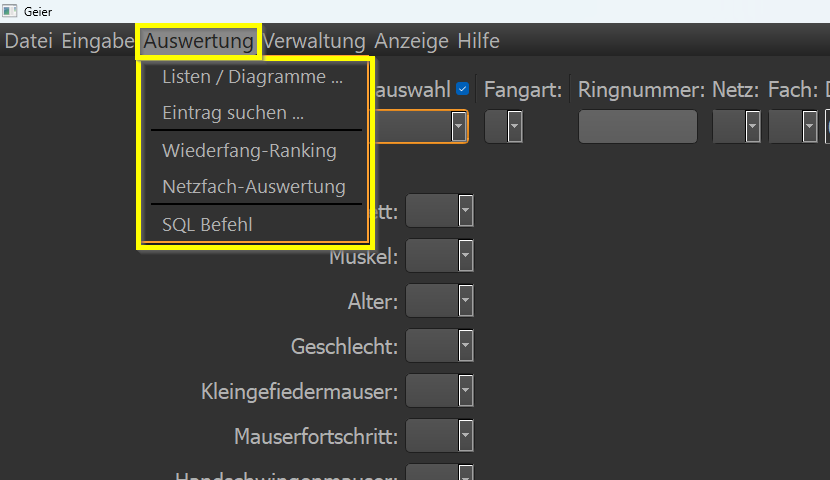

Über das Menü Auswertungen gelangt man zu verschiedenen Auswertungsmöglichkeiten. Jede einzelne soll hier ausführlich
vorgestellt werden, um jeden Benutzer die Möglichkeit zu geben, für sich selbst oder auch für die Station Auswertungen zu machen.

.. note::

    Man kann nichts kaputt machen! Im *schlimmsten* Fall stürzt das Programm ab. Dann bitte einen entsprechenden Fehler absetzen.

Listen / Diagramme
------------------

Die erste Auswertung ist auch die Mächtigste.

Art
~~~

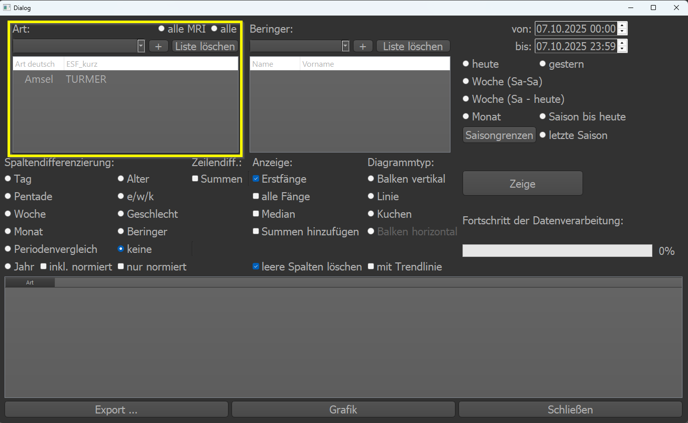

Zuerst sollte man sich überlegen, für welche Arten man Auswertungen machen möchte. Vorausgewählt ist die *Amsel*. Mit einem
Doppelklick auf einen einzelnen Eintrag, lässt sich dieser aus der Liste entfernen. Über die ComboBox lassen sich entweder
Arten per Mausklick hinzufügen oder die Art wird in das Feld eingegeben (wie bei der Eingabemaske auch). Mit dem kleinen Button
``+`` wird die Art dann der Liste hinzugefügt.

Der Button ``Liste löschen`` sollte selbsterklärend sein: die gesamte Artliste wird einmal geleert.

Es gibt noch zwei vordefinierte Listen, die man auswählen kann. ``Alle MRI`` bedeutet, dass alle Arten die für das MRI-Programm
definiert wurden, in die Artenliste eingetragen werden. ``Alle`` trägt alle jemals beringte Arten in die Liste ein.

.. note::

    Doppelklick entfernt einen Eintrag!

Beringer
~~~~~~~~

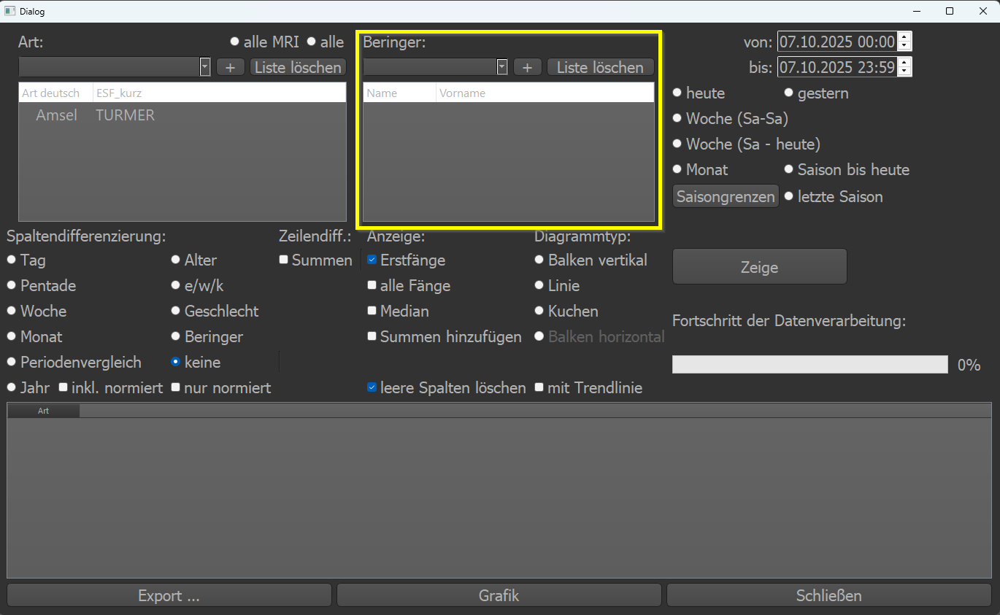

Analog zur Artenliste lassen sich hier Beringer eintragen. Auch hier können einzelne Einträge mit Doppelklick entfernt werden.

Zeitraum
~~~~~~~~

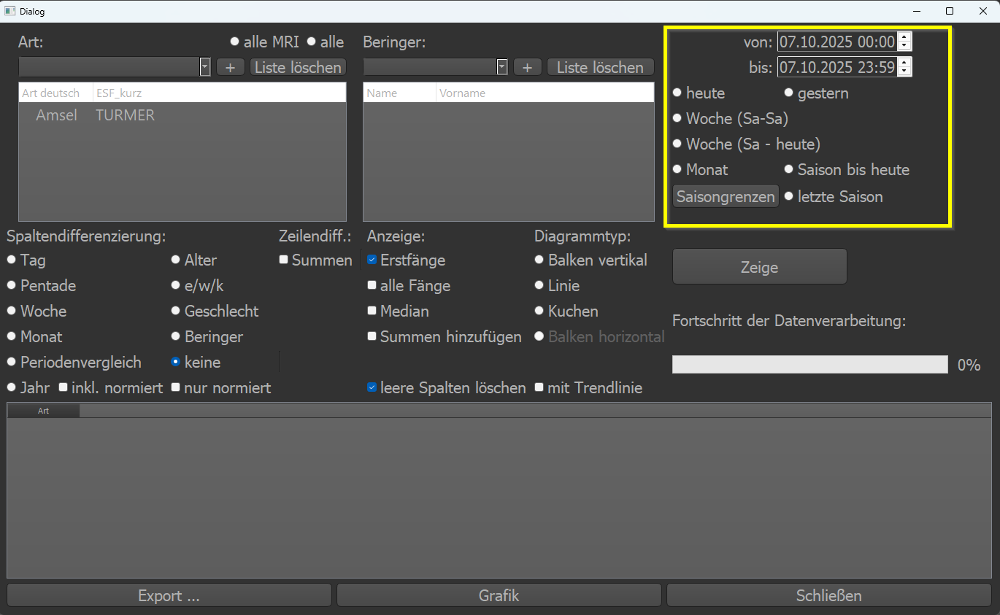

Sehr wichtig für Auswertungen ist die Definition des gewünschten Zeitraumes. Dieser kann direkt eingegeben werden über die
beiden ``von`` und ``bis`` Datumsfelder. Oder es können vordefinierte Zeiträume ausgewählt werden.
``heute`` und ``gestern`` sind selbsterklärend.
``Woche (Sa-Sa)`` wählt die letzte **ganze** Woche von Samstag bis Samstag aus. Wählt man diesen Zeitraum
an einem Montag, so beginnt der gewählte Zeitraum am Samstag vor 9 Tagen und endet am Samstag vor 2 Tagen.
``Woche (Sa-heute)`` wählt den Zeitraum von letztem Samstag bis *heute*.
``Monat``, ``Saison bis heute`` und ``letzte Saison`` sollten wieder selbsterklärend sein.
Mit dem Button ``Saisongrenzen`` lassen sich schnell die beiden Tage 30.06. und 07.11. des aktuellen Jahres eintragen.

Spaltendifferenzierung
~~~~~~~~~~~~~~~~~~~~~~

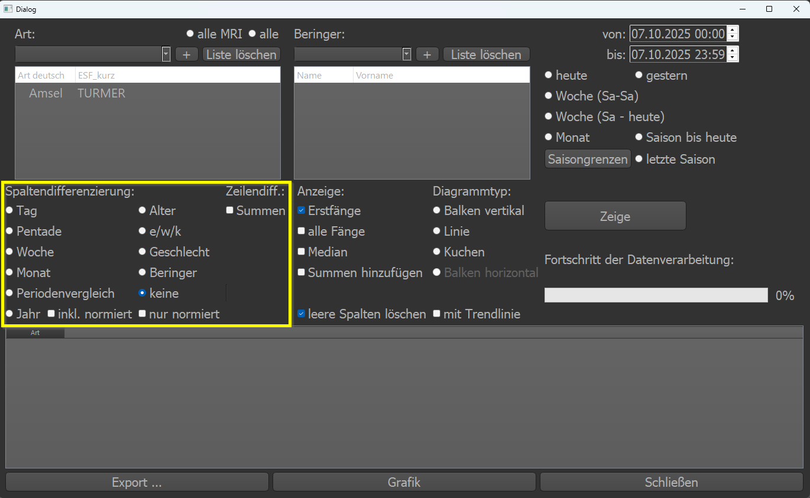

Der komplizierteste Teil der Auswertung. Als Ergebnis erhält man am Ende eine Tabelle. Nach welchen Kriterien die Spalten
voneinander getrennt oder eben *differenziert* werden sollen, wird hier festgelegt.

* Tag: jede Spalte stellt ein Tag dar. :red:`Achtung:` bei der Auswahl von einem Jahr werden 365 Spalten erzeugt!
* Pentade: jede Spalte stellt eine Pentade dar. (1 Pentade beinhaltet fünf aufeinanderfolgende Tage)
* Woche: jede Spalte stellt eine Woche dar.
* Monat: jede Spalte stellt einen Monat dar.
* Jahr: jede Spalte stellt ein Jahr dar.
* Alter: jede Spalte stellt ein Alter dar (also 0, 1, 2, 3, 4, 5, 6, 7, 8, 9, ....)
* e/w/k: es gibt drei Spalten: eine für Erstfänge, eine für Wiederfänge und eine für Kontrollfänge
* Geschlecht: es gibt drei Spalten: 0, 1, 2 (unbekannt, männlich, weiblich)
* Beringer: jede Spalte enthält Daten zu den ausgewählten Beringern
* keine: es gibt keine Differenzierung

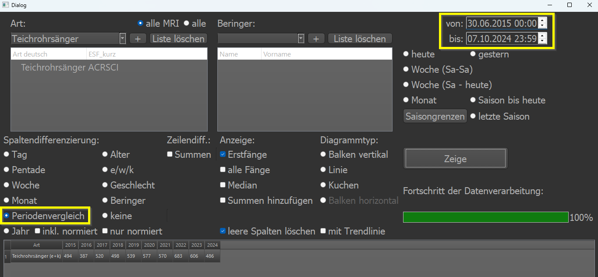

Der :magenta:`Periodenvergleich` ist besonders, daher bekommt er eine gesonderte Beschreibung. Ist der Periodenvergleich
angewählt, so vergleicht Geier die ausgewählte Periode über die entsprechenden Jahre.

Im Beispiel wurde z.B. der 30.06.2015 als Startwert eingetragen und der 07.10.2024 als Endwert. Die Ausgabe des
Periodenvergleichs gibt nun für jedes Jahr (2015-2024) die Anzahl der ausgewählten Arten (in dem Fall nur Teichrohrsänger) für
die definierte Periode (30.06. - 07.10.) aus. So lässt sich schnell vergleichen, ob das aktuelle Jahr *besser*, *schlechter*
oder *ähnlich* ist wie die Jahre zuvor indem man das heutige Datum als Enddatum vorgibt.

Die **Zeilendiff.** Option ermöglicht es, alle Zeilen zusammenzufassen als Summe. Möchte man zum Beispiel nur die Fangsummen
aller Fänge darstellen, so lässt sich dies mittels dieser Option bewerkstelligen:

Vor der Anwahl Zeilendiff.:

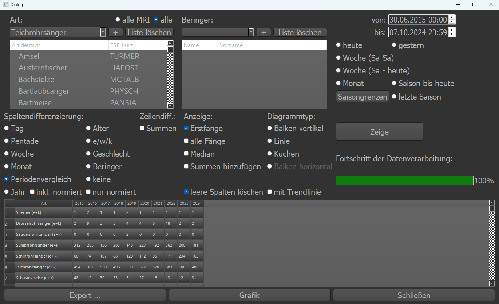

Nach der Anwahl Zeilendiff.:

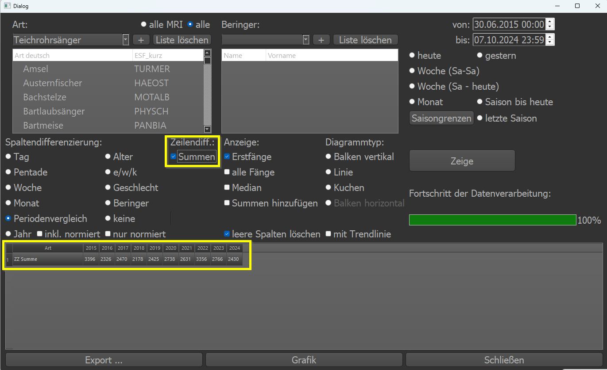

.. note::

    Man kann dies ändern, ohne Daten neu einlesen zu müssen. Nach der Ausgabe einfach ein-/ausschalten.

Anzeige
~~~~~~~

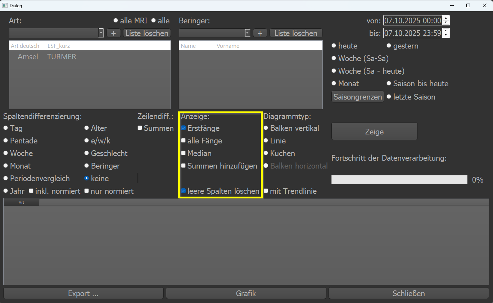

Welche Daten sollen (als extra Zeilen) angezeigt werden. Hier kann man ``Erstfänge`` oder/und ``alle Fänge`` auswählen. Bei
passender Spaltendifferenzierung lässt sich auch ``Median`` auswählen. Dieser gibt dann für den angegrenzten Zeitraum den
Median an.

Der Eintrag ``Summen hinzufügen`` fügt eine (letzte) Spalte hinzu mit den Summen über die Zeile (Summe über Spalte 1 bis Spalte
n für jede einzelne Zeile).

Mit ``leere Spalten löschen`` lassen sich alle komplett leeren Spalten aus der Anzeige entfernen. Also Spalten die in allen
Zeilen den Wert 0 enthalten (würden).

Diagrammtyp
~~~~~~~~~~~

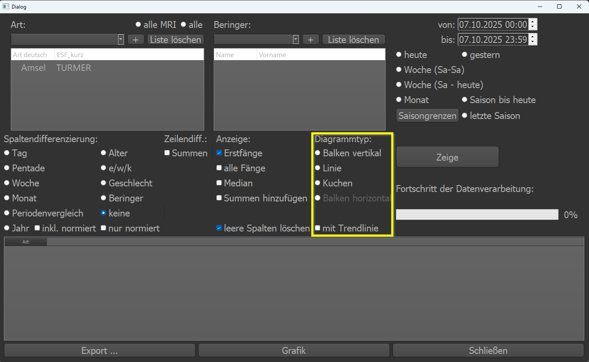

Möchte man die Tabelle als Grafik anzeigen lassen, muss man den Diagrammtyp auswählen. Die Option ``mit Trendlinie`` fügt eine
entsprechende Trendlinie ein. Das ist nur bei Liniendiagrammen sinnvoll nutzbar.

Auswahl starten / Zeige
~~~~~~~~~~~~~~~~~~~~~~~

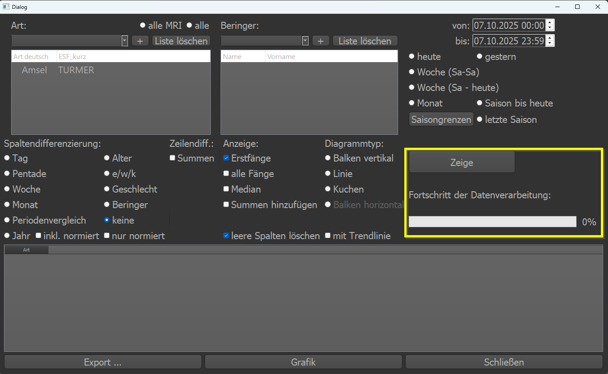

Hat man alle Auswahlen vorgenommen, startet man die Datenbankabfrage mit dem Button ``Zeige``.

.. note::

    Der Button **Zeige** startet die Datenbankabfrage und füllt die Tabelle gemäß der Auswahl

Der Fortschritt der Abfrage oder Datenverarbeitung lässt sich am Fortschrittsbalken verfolgen. :red:`ACHTUNG!` Die Abfrage
lässt sich nicht abbrechen. Hat man alle Arten über mehrere Jahre ausgewählt und möchte über den Tag differenzieren (also
tausende Spalten und Zeilen) ist das Programm über Stunden "nicht ansprechbar".

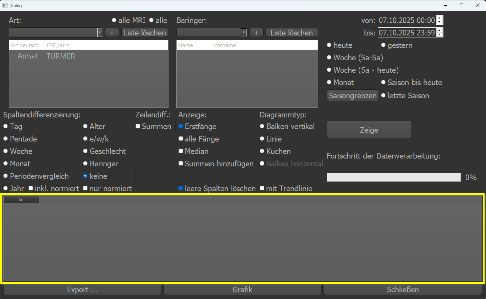

Im unteren Bereich des Fensters wird das Ergebnis tabellarisch angezeit.

Buttonleiste
~~~~~~~~~~~~

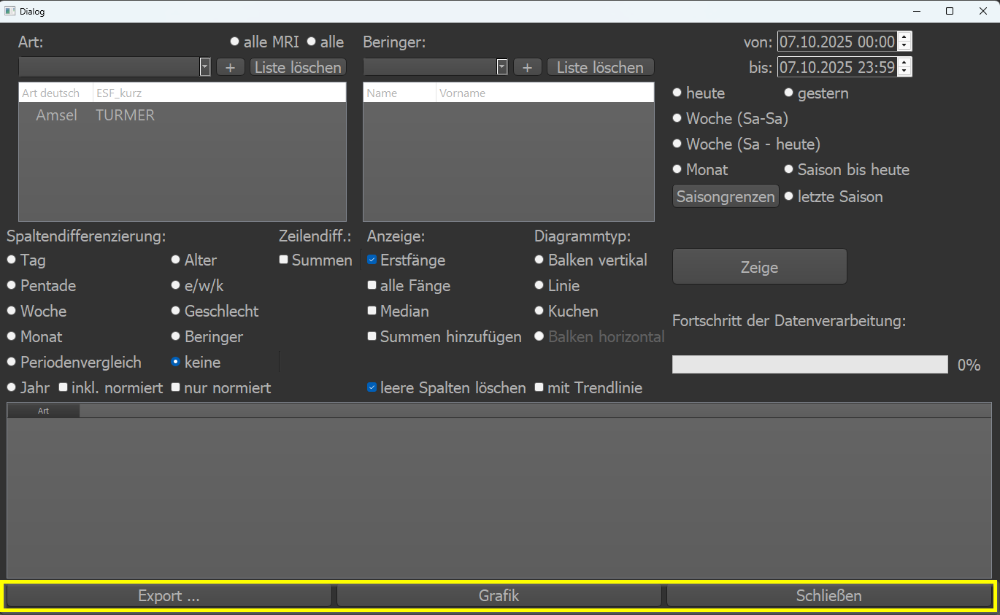
x
* Export: es wird eine *.csv der Ergebnistabelle exportiert
* Grafik: Es wird eine Grafik laut den Diagrammeinstellungen angezeigt
* Schließen: Beenden

