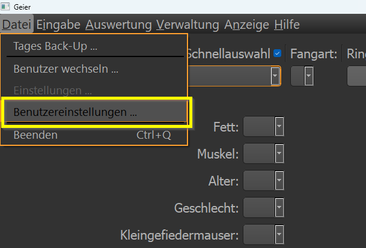
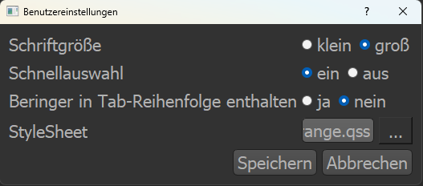

.. include:: ../special.rst

Benutzereinstellungen
=====================

Über das Menü > Datei > Benutzereinstellungen gelangt man zu den Benutzereinstellungen (wer hätte es gedacht).

* Die Schriftgröße kann zwischen klein und groß eingestellt werden.
* Die dauerhafte Aktivierung der Schnellauswahl kann ein/aus geschaltet werden. (gilt für den Benutzer reit)
* Manche Beringer:innen mögen bei jeder Dateneingabe dass nach dem Netzfach der Beringer in der Reihenfolge eingebunden wird.  Dies lässt sich hier einstellen.
* Es lassen sich StyleSheets auswählen. :red:`VORSICHT!` Es kann sein, dass bei der Auswahl eines ungünstigen StyleSheets  einige Texte nicht mehr ordentlich lesen lassen. Hier muss man sich merken, wie man wieder zu dieser Auswahl kommt.

Alle Einstellungen gelten nur für den Benutzer *reit* und lassen sich immer ändern.
