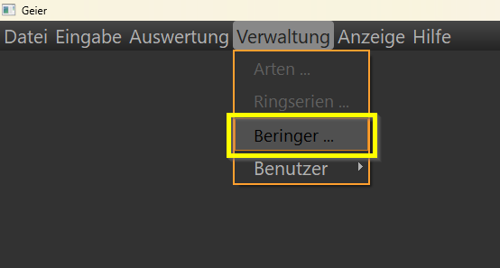
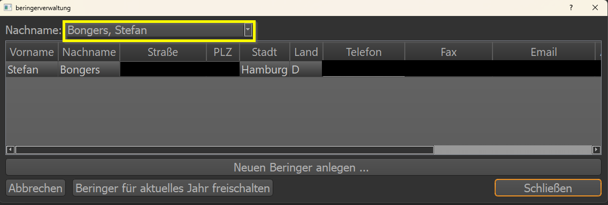
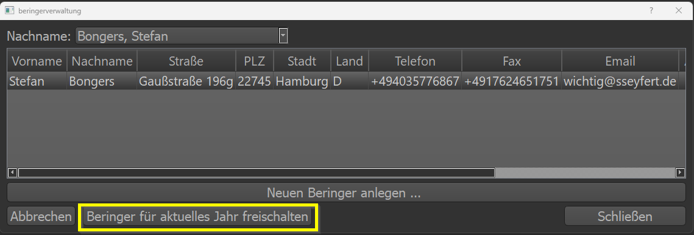
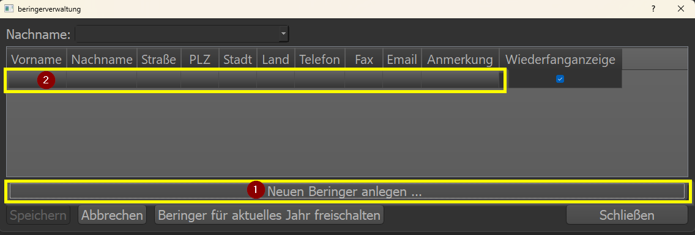

Beringerverwaltung
==================

Über das Menü Verwaltung > Beringer lässt sich die Beringerverwaltung öffnen. Im Feld Name lässt sich ein Eintrag nach Name
suchen. Die Namen werden nach dem Muster *Nachname, Vorname* gespeichert.

Der Eintrag lässt sich nur betrachten, jedoch nicht ändern. Hier sind Adminrechte notwendig.

Über den Button ``Beringer für aktuelles Jahr freischalten`` kann man den Eintrag in der Eingabemaske erzeugen.
Ist der:die Beringer:in freigeschaltet, taucht er/sie im Dropdown auswählbar auf.

Über den Button ``Neuen Beringer anlegen ...`` wird ein neuer Eintrag erzeugt. Die Eingaben werden direkt in der Tabelle
vorgenommen. Nachname und Vorname sind dabei obligatorisch. Alle weiteren Informationen optional.

