Die Eingabemaske
================
Die Eingabemaske ist das Herzstück von Geier. Hier werden die einzelnen Datensätze der Vögel eingegeben und gespeichert.

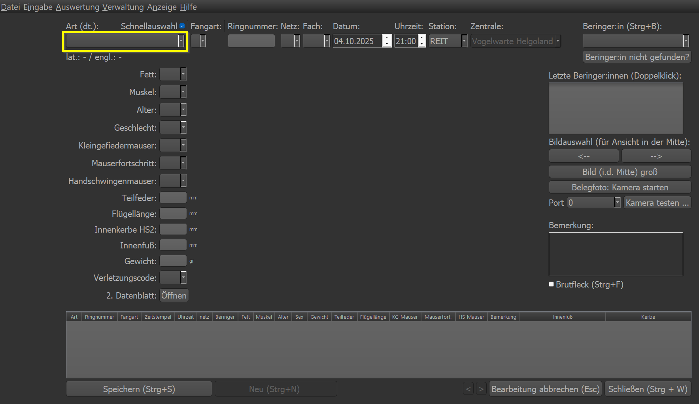

Beim Aufruf über das Menü wartet Geier auf die Eingabe einer Art. Der *deutsche Artname* wird erwartet. Die Art kann auch über
das Dropdown ausgewählt werden.

Art und Schnellauswahl
~~~~~~~~~~~~~~~~~~~~~~
Folgende Arten sind als *Schnellauswahl* hinterlegt. Das bedeutet, dass bei der Eingabe der ersten beiden Buchstaben die Art
automatisch ausgefüllt wird und der Cursor in das nächste Feld Fangart springt:

* **Am**\sel
* **Do**\rngrasmücke
* **Ei**\vogel
* **Fi**\tis
* **Kl**\appergrasmücke
* **Ko**\hlmeise
* **Mö**\nchsgrasmücke
* **Si**\ngdrossel
* **Su**\mpfrohrsänger
* **Te**\ichrohrsänger
* **Za**\unkönig
* **Zi**\lpzalp

Die Schnellauswahl lässt sich über die Checkbox über der Arteingabe ein- bzw. ausschalten. Über das :doc:`Menü >
Benutzereinstellungen <benutzereinstellungen>` lässt sich die Schnellauswahl für den Benutzer dauerhaft ein- bzw. ausschalten.

Fangart
~~~~~~~
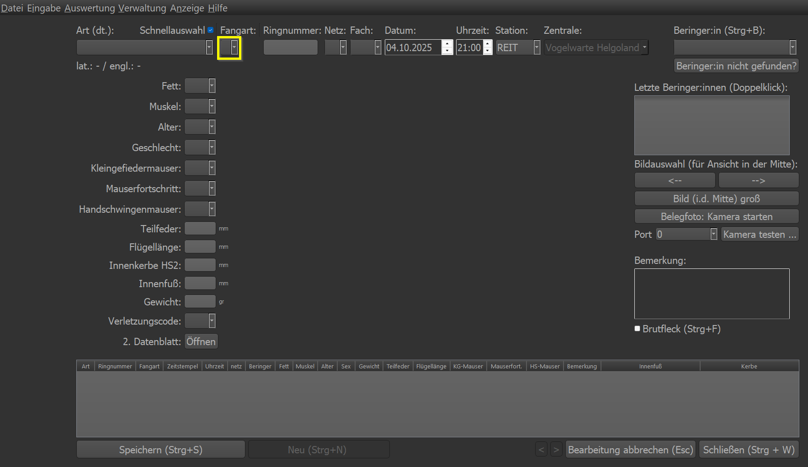

Hier wird die entsprechende Fangart eingestellt. Folgende Auswahl steht zu Verfügung:

* **e** für Erstfang (Vogel hat keinen Ring und wird zum ersten Mal beringt)

* **w** für Wiederfang (das ist immer auszuwählen, wenn der Vogel bereits einen Ring hat)

* **d** für Defekt (wenn ein Ring beim Beringen kaputt gegangen ist und nicht mehr verwendet werden kann)

* **k** für Kontrollfang (vorrangig **nicht** verwenden, da das Programm diese Einstellung selbstständig vornimmt)

* **f** für Fremdfang (wenn sicher ist, dass es sich um einen Wiederfang handelt, der nicht an der eigenen Station und Zentrale
    beringt wurde - auch dies schlägt das Programm selbstständig vor, falls der Ring nicht in der Datenbank enthalten ist)

Ringnummer
~~~~~~~~~~
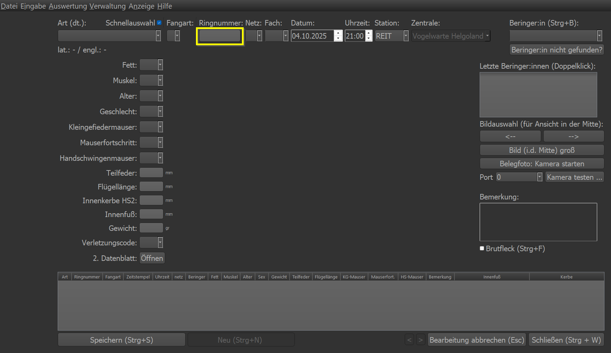

Hier wird die nächste, automatisch erkannte Ringnummer eingetragen, sollte es sich um einen Erstfang handeln. Im Falle eines
Wiederfangs muss hier die Ringnummer manuell eingegeben werden.

Netz und Fach
~~~~~~~~~~~~~
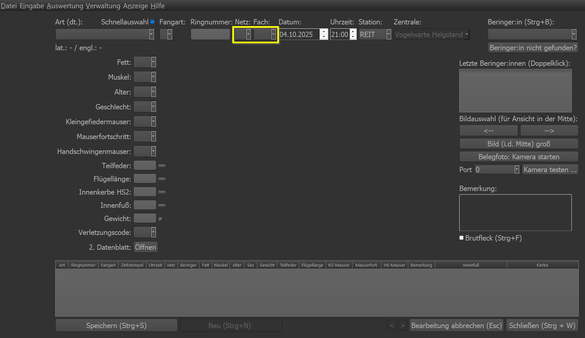

Die Netznummer und die Kombination Fach/Seite wird in diese beiden Felder eingetragen. Also z.B. 23 für Netz 23 und 3L für 3.
Fach von links reingeflogen.

Station
~~~~~~~
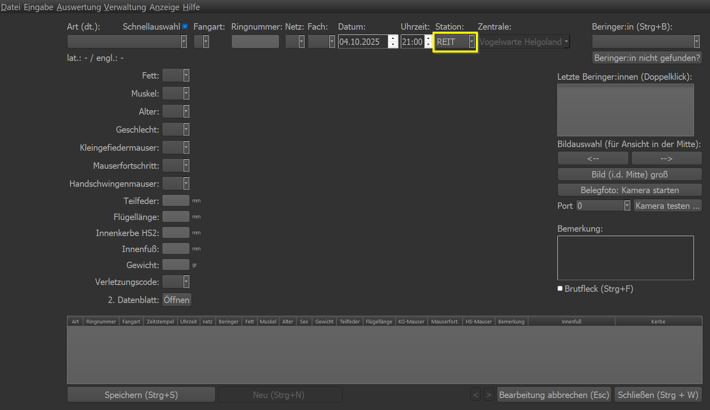

Hier kann die (eigene) Station eingetragen und definiert werden.

Zentrale
~~~~~~~~
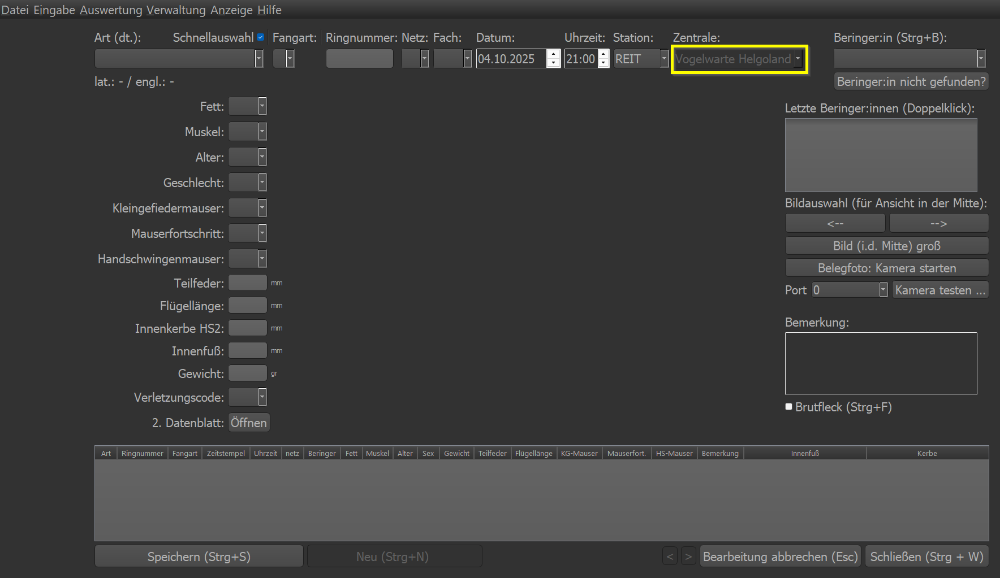

Hier wird die zugehörige Beringungszentrale eingestellt. Dies ist normalerweise nicht editierbar. Im Falle eines Fremdfangs
wird das Eingabefeld freigegeben. Dies kann mit Adminrechten geändert werden.

Beringereinstellungen
~~~~~~~~~~~~~~~~~~~~~
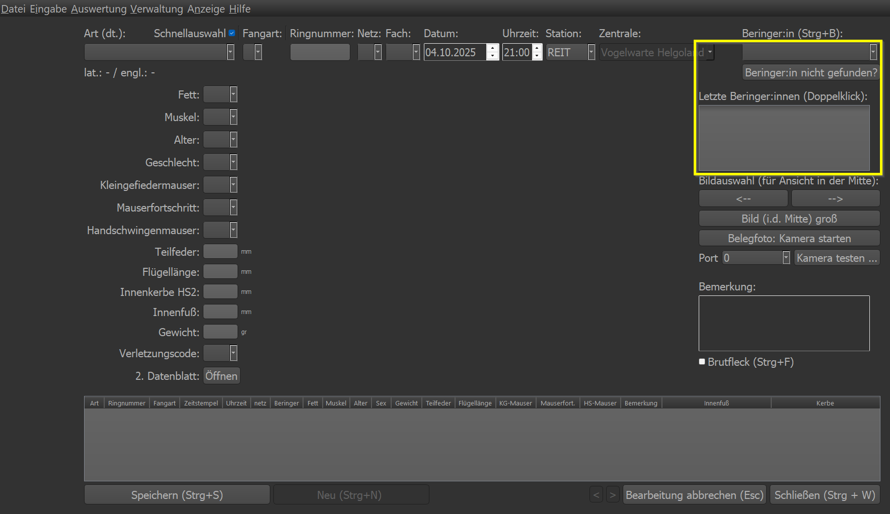

Im Feld Beringer:in wird der/die Beringer:in eingetragen. Sollte der Name nicht auftauchen, so hat er/sie in diesem Jahr wohl
noch nicht beringt und ist daher noch nicht freigeschaltet. Mit dem Klick auf den Button ``Beringer:in nicht gefunden?`` landet
man in der Beringerverwaltung in der eine entsprechende Freischaltung für das aktuelle Jahr erfolgen kann. Siehe hier
:doc:`Beringerverwaltung <beringerverwaltung>`

In der Liste ``Letzte Beringer:innen (Doppelklick)`` lassen sich direkt mittels Doppelklick die entsprechenden Namen anwählen
und als Beringer:in eintragen. Dies ist für die Besatzung eine Erleichterung da es schnell die richtige Auswahl ermöglicht.

Biometrische Daten
~~~~~~~~~~~~~~~~~~
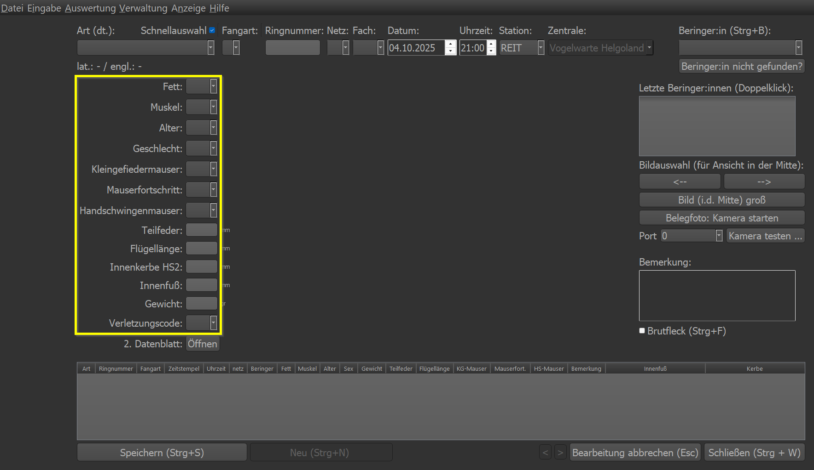

In diesem Bereich werden die biometrischen Daten eingegeben. Die möglichen Werte lassen sich über das Dropdownmenü einsehen.
Mit Rechtsklick auf das Dropdownmenü erhält man eine Dokumentation über die einzelnen biometrischen Daten.

Bild & Bildsteuerung
~~~~~~~~~~~~~~~~~~~~
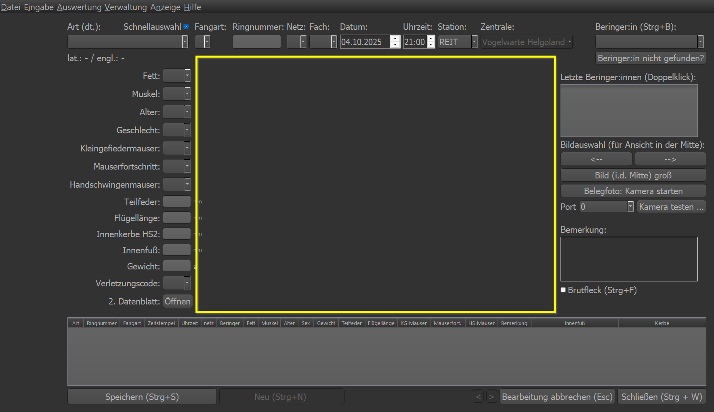

Der freie Bereich in der Mitte ist für die Anzeige von Bildern reserviert. Sobald eine Art angegeben wurde, wird das erste
gefundene Bild im zugehörigen Bild-Ordner angezeigt.

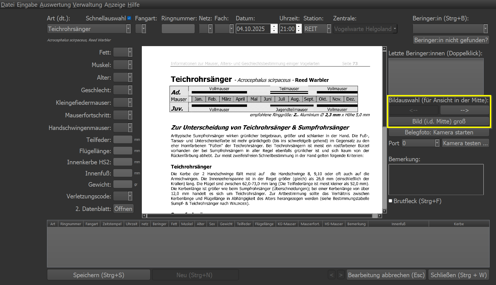

Mittels der beiden Pfeiltasten lassen sich die Bilder im artzugehörigen Bilderordner anwählen/auswählen. Mittels ``Bild (i.d.
Mitte) groß`` lässt sich das angezeigte Bild in einem separaten Fenster öffnen und groß skalieren.

Kamera
~~~~~~
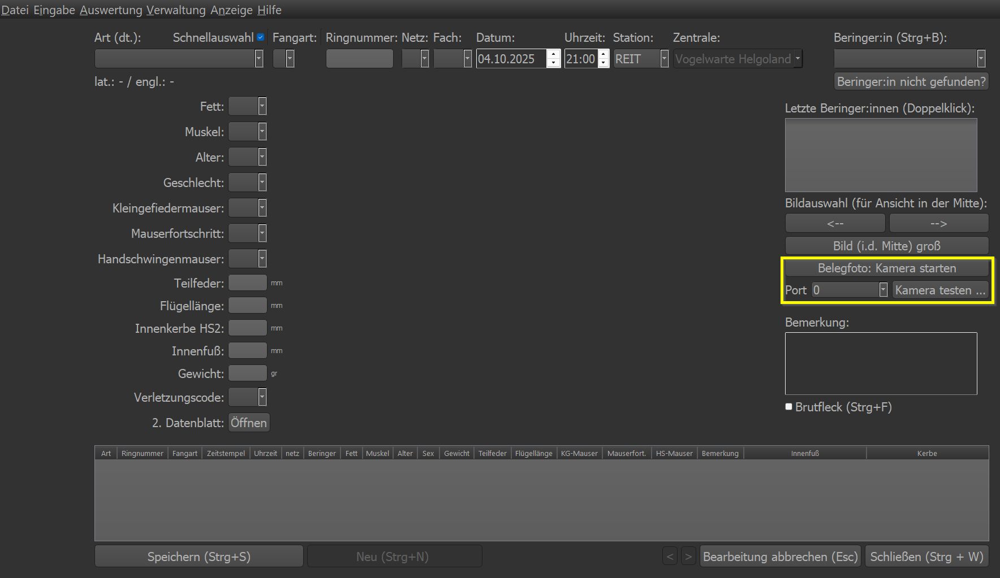

Ist eine Kamera installiert und parametriert, lässt sich über den Knopf ``Belegfoto: Kamera starten`` ein Foto aufnehmen. Es
öffnet sich ein separates Fenster. Sobald das Bild aufgenommen werden soll, muss die *Leertaste* gedrückt werden.

Mit ``Kamera testen`` lässt sich die Einstellung der Kamera testen. Zusammen mit der Portauswahl kann man die richtige Kamera
"finden".

Bemerkung
~~~~~~~~~
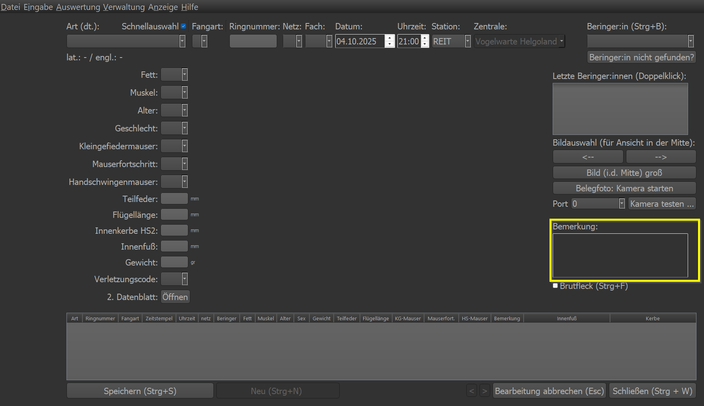

Hier kann eine Bemerkung zum Datensatz eingegegeben werden. Dies ist bitte nur in Ausnahmefällen zu nutzen! Alle wichtigen
Daten werden über die Eingabemaske abgefragt. Auch sind 99% der Verletzungen über den Verletzungscode abgedeckt. Beispiel für
eine sinnvolle Bemerkung: "*Handschwingenmauser nur am rechten Flügel*"

Brutfleck
~~~~~~~~~
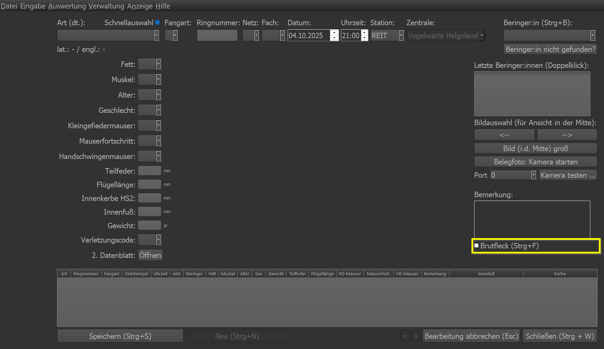

Hat der Vogel einen Brutfleck, soll dies über das Anwählen der Checkbox gesichert werden. Shortcut ist Strg+f/Strg+F.

Wiederfangliste
~~~~~~~~~~~~~~~
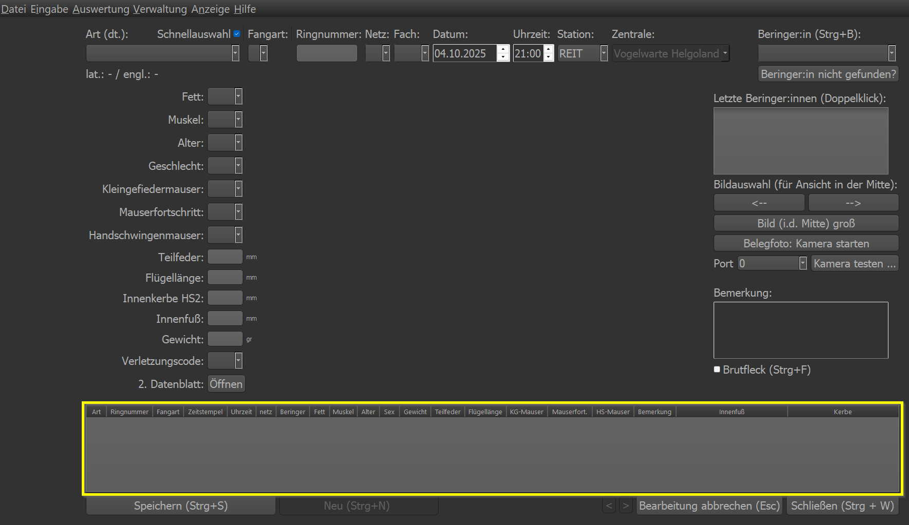

Hier zeigt Geier bei einem Wiederfang die bisher aufgenommenen Datensätze des Vogels an. Es ist keine Bearbeitung möglich.

Buttonleiste
~~~~~~~~~~~~
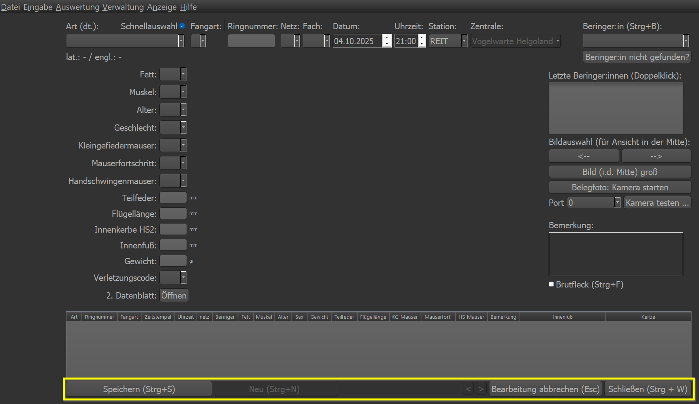

Mit "*Speichern*" lässt sich der aktuelle Datensatz speichern. "*Neu*" öffnet einen neuen, leeren Datensatz für die Eingabe.
"*Bearbeitung abbrechen*" bricht die aktuelle Bearbeitung ab und zeigt den letzten gespeicherten Datensatz an. Mit den beiden
Pfeiltasten "*<*" und "*>*" kann man den vorherigen bzw. nächsten Datensatz auswählen. "*Schließen*" führt dazu, dass die
Eingabemaske geschlossen wird.

